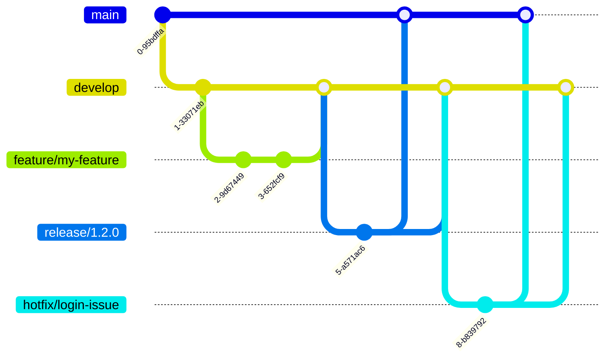

Check out the configuration reference at https://huggingface.co/docs/hub/spaces-config-reference

Voici la version mise à jour avec les commandes Git Flow spécifiques :

```markdown
# GED Monitoring - React Application

[](https://react.dev/)
[](https://vitejs.dev/)

Real-time monitoring application for EDM (Electronic Document Management) with dashboard.

## Key Features
- Real-time document monitoring
- Interactive dashboards with charts
- Internationalization (i18n)
- Dark/Light theme
- WebSocket connection
- State management with Redux

## Prerequisites
- Node.js v22+
- Git Flow (`brew install git-flow` on macOS)

## Installation
```bash
# Install dependencies
yarn install

# Initialize Git Flow in your repository
git flow init -d
```

## Environment Configuration
The application uses 3 environments configured via `.env` files:

| Variable         | Description                     | Example Values                     |
|------------------|---------------------------------|-----------------------------------|
| `VITE_API_URL`   | Base API URL                   | `http://localhost:6001`           |
| `VITE_PREFIXE_URL`| Endpoint prefix                | `/ws-dev`, `/ws-test`, `/ws`     |
| `VITE_API_KEY`   | Encrypted API key              | `cbp_dev_key_...`                 |

Preconfigured environments:
1. **Dev** (`.env.dev`) : Local development
2. **Test** (`.env.test`) : Test environment
3. **Prod** (`.env.prod`) : Production environment

## Available Commands

### Development
```bash
# Run in development mode
yarn run dev

# Access the application
http://localhost:9090
```

### Builds
```bash
# Build for development
yarn run build:dev

# Build for test environment
yarn run build:test

# Build for production
yarn run build:prod
```

### Preview
```bash
# Preview production build
yarn run build:prod
yarn run start
```

## Technical Architecture
```plaintext
MONITORING/
├── public/             # Static assets
├── src/
│   ├── components/     # React components
│   ├── i18n/           # Internationalization files
│   ├── redux/          # Redux store (actions, reducers)
│   ├── services/       # API/WebSocket services
│   ├── styles/         # Global stylesheets
│   ├── utils/          # Utilities (encryption, helpers)
│   ├── App.jsx         # Main component
│   └── main.jsx        # Entry point
├── .env.dev            # Dev variables
├── .env.test           # Test variables
├── .env.prod           # Prod variables
└── vite.config.js      # Vite configuration
```

## Key Dependencies
- **State Management**: `redux`, `react-redux`, `redux-thunk`
- **UI**: `tailwindcss`, `lucide-react`, `@headlessui/react`
- **Charts**: `lightweight-charts`
- **I18n**: `i18next`, `react-i18next`
- **Communication**: `socket.io-client`
- **Security**: `crypto-js` (encryption)

## Git Flow Workflow

### Installation
```bash
# macOS
brew install git-flow

# Linux
apt-get install git-flow

# Windows (using Git Bash)
wget -q -O - --no-check-certificate https://raw.githubusercontent.com/petervanderdoes/gitflow/develop/contrib/gitflow-installer.sh | bash
```

### Feature Development
```bash
# Start a new feature
git flow feature start my-feature

# Develop your feature (make code changes)
yarn run dev

# Publish feature to remote
git flow feature publish my-feature

# Finish feature (merge to develop and delete branch)
git flow feature finish my-feature
```

### Release Management
```bash
# Start a new release
git flow release start 1.2.0

# Bump version in package.json
# Update CHANGELOG.md

# Publish release
git flow release publish 1.2.0

# Finish release (merge to main and develop, create tag)
git flow release finish 1.2.0

# Push tags to remote
git push origin --tags
```

### Hotfixes
```bash
# Start hotfix from main branch
git flow hotfix start login-issue

# Fix the critical issue
# Test with: yarn run build:prod && yarn run start

# Finish hotfix
git flow hotfix finish login-issue

# Push changes
git push origin main develop --tags
```

### Bugfixes (non-critical)
```bash
# Start bugfix from develop branch
git flow bugfix start chart-rendering

# Fix the issue
# Test with: yarn run dev

# Finish bugfix
git flow bugfix finish chart-rendering
```

### Branch Structure


## License
[MIT](https://choosealicense.com/licenses/mit/)
```

## Recommended Customizations
1. Add dashboard screenshots in a `## Screenshots` section
2. Complete the license section according to your policy
3. Add specific deployment instructions (Docker, Kubernetes, etc.)
4. Specify additional environment variables if needed
5. Add a link to your detailed technical documentation

Ce README inclut :
- Installation spécifique de Git Flow pour tous les systèmes
- Commandes Git Flow complètes pour features/releases/hotfixes/bugfixes
- Workflow visuel avec diagramme Mermaid
- Intégration avec le processus de développement (yarn commands)
- Structure de branche claire avec conventions de nommage
- Processus complet de publication des releases avec gestion de version