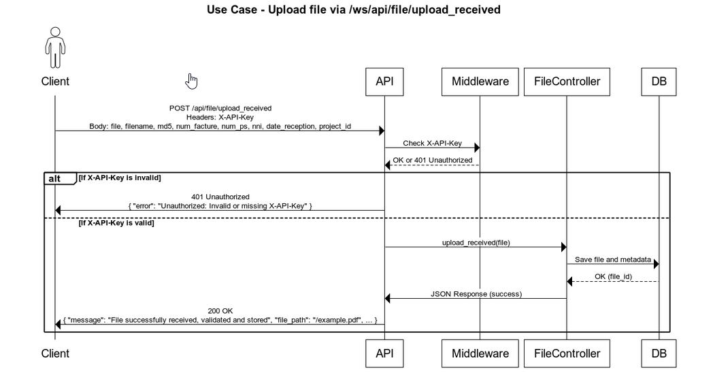
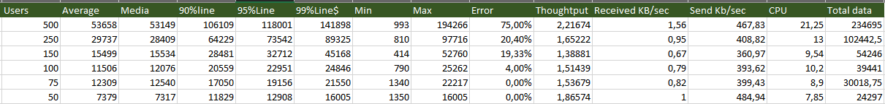
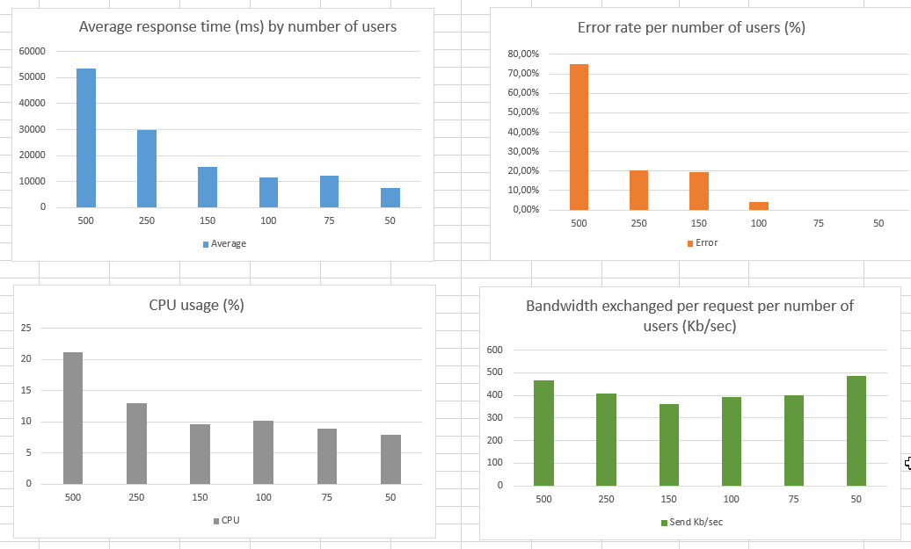

# GED API Documentation: PDF Upload

## Version History

| Date       | Version No. | Nature of Changes | Written by               | Verified by | Validé par |
|------------|-------------|-------------------|--------------------------|-------------|------------|
| 07/11/2025 | 01          | Creation          | RAMAROSON Nambinintsoa Rovatiana | -           | -          |

---

## Table of Contents

1. [Purpose of Document](#purpose-of-document)  
2. [Scope](#scope)  
3. [Use Case](#use-case)  
4. [API Details](#api-details)  
   - [Attributes](#attributes)  
   - [Sample Response](#sample-response)  
   - [Sample Request](#sample-request)  
5. [Header](#header)  
6. [Authentication & Security](#authentication--security)  
7. [Load & Performance](#load--performance)  
8. [Error Codes](#error-codes)  
9. [Necessary Rights](#necessary-rights)  
10. [Monitoring](#monitoring)  

---

## Purpose of Document

**Application Base:**  
- **Name:** API GED  
- **Environment:** Prod  

This document provides technical documentation for a Flask-based REST API designed for secure PDF file uploads. It includes validation, MD5 hash verification, duplicate detection, and logging.

---

## Scope

This API enables secure PDF uploads with integrity checks and duplicate prevention. It is primarily for internal use within document management systems and can be extended for other clients.

---

## Use Case



---

## API Details

### Overview
- **Method:** POST  
- **Endpoint:** `/ws/api/file/upload_received`  
- **API Key:** `example_ac7ea0bf157549baaa243ec16dc2c2cd`  
- **Description:** Uploads a PDF with metadata, performs validation, MD5 check, duplication detection, and logs actions.

### Attributes (Form Fields)

| Field          | Type       | Required | Description                                  |
|----------------|------------|----------|----------------------------------------------|
| file           | File (PDF) | Yes      | PDF file to upload                           |
| filename       | String     | Yes      | Original filename                            |
| md5            | String     | Yes      | MD5 checksum of the file                     |
| num_facture    | String     | Yes      | Invoice number                               |
| num_ps         | String     | Yes      | Internal reference code                      |
| nni            | String     | Optional | User identification number                   |
| date_reception | String     | Yes      | Reception date (format: `YYYYMMDD`)          |
| project_id     | String     | Yes      | Project ID (e.g., `4` for SE project)        |

### Sample Response

```json
{
  "message": "File successfully received, validated and stored",
  "filename": "example.pdf",
  "md5": "d41d8cd98f00b204e9800998ecf8427e",
  "size_bytes": 132489,
  "num_facture": "INV-202507",
  "num_ps": "PS-9999",
  "nni": "1234567890123456",
  "date_reception": "20250715",
  "file_path": "/var/www/files/2025-07-15/example.pdf",
  "conversion_job_id": "1721724849.678021",
  "conversion_status": "queued"
}
```
### Sample Request

```bash
curl -X POST http://app.cbp.ged.openstack.local/ws-test/api/file/upload-received \
  -H "X-API-Key: cbp_test_key_xxxxxxxxxxxxxxxxxxxxxxxxxxxx" \
  -F "file=@"/d/pdf/compressed/9782753576858_app_v4.pdf"" \
  -F "filename=Mindset.txt_sp" \
  -F "md5=c8b59895095859b1d1fef8f735a95442" \
  -F "num_facture=INV-202507" \
  -F "num_ps=PS-9999" \
  -F "nni=1234567890123456" \
  -F "date_reception=20250715" \
  -F "project_id=NE0401"
```

---

## Header

| Header       | Required | Description                          |
|--------------|----------|--------------------------------------|
| X-API-Key    | Yes      | API key for authentication           |
| X-File-MD5   | Optional | Alternative way to pass MD5 checksum |
| User-Agent   | Yes      | Automatically sent by client         |

---

## Authentication & Security

| Aspect             | Details                                                                 |
|--------------------|-------------------------------------------------------------------------|
| Authentication     | Custom header-based API key (`X-API-Key`)                               |
| CSRF Protection    | Not applicable (API endpoints)                                          |
| Secure Headers     | Validates `X-API-Key` before processing                                 |
| File Validation    | MIME type check (PDF only), empty filename prevention                   |
| Integrity Check    | MD5 checksum comparison (provided vs computed)                          |

---

## Load & Performance

| Aspect            | Details                                                                 |
|-------------------|-------------------------------------------------------------------------|
| Max File Size     | Recommended: up to 10 MB for PDF                                        |
| Response Time     | 300–1000 ms (depends on disk, DB, and conversion speed)                |
| Heavy Operations  | MD5 hashing, File I/O, DB insert, PDF → JPG conversion                 |
| Optimizations     | Reuse checksum for duplication checks                                   |

**Stress Test Results:**  

 

  

---

## Error Codes

| HTTP Status       | Cause                                      | Example Response                              |
|-------------------|--------------------------------------------|-----------------------------------------------|
| 400 Bad Request   | File not provided                          | `{ "error": "File not provided" }`            |
| 400 Bad Request   | Missing required fields                    | `{ "error": "Missing fields", "fields": [...] }` |
| 400 Bad Request   | Invalid content type (not PDF)             | `{ "error": "Non-PDF type received" }`        |
| 400 Bad Request   | MD5 mismatch                               | `{ "error": "Invalid MD5 for file.pdf" }`     |
| 401 Unauthorized  | Missing/invalid `X-API-Key`                | `{ "error": "Unauthorized: Invalid API key" }`|
| 409 Conflict      | Duplicate file (MD5 match)                 | `{ "error": "File already received" }`        |
| 500 Server Error  | Internal error (I/O, DB, etc.)             | `{ "message": "Error processing file", ... }` |

---

## Necessary Rights

| Right/Access       | Required  |
|--------------------|-----------|
| Valid API Key      | Yes       |
| Role-based Control | No        |
| IP Filtering       | No        |

---

## Monitoring

| What is Logged                | Location          |
|-------------------------------|-------------------|
| Success & errors              | `action.log` + DB |
| IP address                    | `action.log` + DB |
| User-Agent                    | `action.log` + DB |
| File checksum (MD5)           | `action.log` + DB |
| Duplication events            | `action.log` + DB |
| Corrupt/invalid files         | `action.log` + DB |
| Job conversion                | `action.log` + DB + Monitoring UI |

**Logs are stored in both `action.log` and the database.**

## Monitoring UI Access URLs

| Environment | Monitoring UI URL                                                                            |
| ----------- | ---------------------------------------------------------------------------------------- |
| TEST        | [http://app.cbp.ged.openstack.local/ws-test](http://app.cbp.ged.openstack.local/ws-test) |
| PROD        | [http://app.cbp.ged.openstack.local/ws](http://app.cbp.ged.openstack.local/ws)           |

> **Header Required:** `X-API-KEY`

---

© 2025 – Any partial or full reproduction without permission is prohibited.
